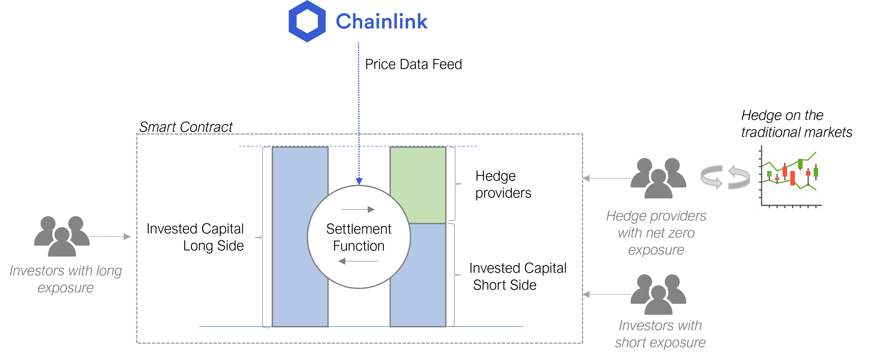

# Pooled Derivatives (draft)

1. This project provides a framework for on-chain derivatives that are based on liquidity pools instead of counterparty settlement

2. An automated hedging mechanism aims to ensure that the settlement remains stable

3. The contracts features three parties: two parties taking long and short exposure repectivly and one party providing the hedge

Idea: Inclunding a hedging party addresses the issue of synthetic on-chain assets that have instable exposure to the underlying

